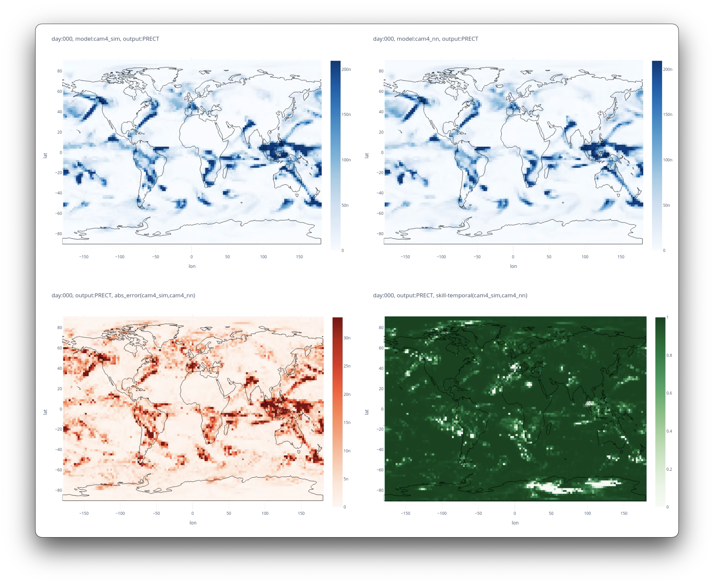

# GAIA: Global AI Accelerator <!-- omit in toc --> 

This repository contains code for training and running climate neural network surrogate models. For detais on various experiments visit our site *https://stresearch.github.io/gaia/*

 ***Warning:** This is an active research project. The code base is constantly evolving as new features are being added and old ones are depreciated.*

- [Installation](#installation)
- [Data Preprocessing](#data-preprocessing)
- [Training](#training)
  - [Parameters](#parameters)
- [Inference](#inference)

>This work is part of the DARPA ACTME (AI-assisted Climate Tipping-point Modeling) AIE Program - https://github.com/ACTM-darpa/info-and-links

[](https://stresearch.github.io/gaia/)


# Installation

Install requirments: 

```bash
git clone https://github.com/stresearch/gaia
pip install -r requirements
```

# Data Preprocessing

We work with outputs from two climate models: CAM4 and SPCAM. 
- We assume raw data resides in an S3 bucket with one file per day in the `NCDF4` format. 
- To prepocess the data we use a fairy large AWS EC instance:
  -  `r4.16xlarge` with 64 CPUs
  -  attach at least 500GB EBS volume for local caching

To run prepocessing from an AWS instance with default parameters for split=`train,test`:
```python
NCDataConstructor.default_data(
        cls,
        split="train",
        bucket_name="name_of_bucket",
        prefix="spcamclbm-nx-16-20m-timestep",
        save_location=".",
        train_years = 2,
        cache = ".",
        workers = 64
    )
```

We assume the following input/output variables:  

```python
inputs="Q,T,U,V,OMEGA,PSL,SOLIN,SHFLX,LHFLX,FSNS,FLNS,FSNT,FLNT,Z3".split(",")
outputs="PRECT,PRECC,PTEQ,PTTEND".split(",")
```

This should generate 4 files:
```
spcamclbm-nx-16-20m-timestep_4_test.pt   spcamclbm-nx-16-20m-timestep_4_val.pt   
spcamclbm-nx-16-20m-timestep_4_train.pt  spcamclbm-nx-16-20m-timestep_4_var_index.pt
```

Copy to machine where you want to train the model.

For more details see [`gaia.data` module](https://github.com/stresearch/gaia/blob/c0268fa86aac53b04626ba77ebba1c76293f7557/gaia/data.py#L454)

# Training

To perform training, we use a machine with at least a single GPU and 64GBs of RAM (to load the full dataset into memory)

To run default training:
```bash
python run_omega.py \
general_params.mode='train,val,test,predict' \
trainer_params.max_epochs=200 \
trainer_params.gpus=[0] \
model_params.model_type="fcn" \
dataset_params.dataset='cam4' \

```

## Parameters

For default parameters consult `gaia.config.Config` class. There are four groups of parameters: `general_params, trainer_params, dataset_params, model_params` .

Parameters can be specified by 
- directly passing nested dictionaries for each
- pass in nothing which will automatically read in defaults from Config
- command line arcugemens using the `dot` notation to override specified Config defaults

Example configs:

```python
dataset_params = 
{'test': {'batch_size': 138240,
  'dataset_file': '/ssddg1/gaia/cam4/cam4-famip-30m-timestep_4_test.pt',
  'flatten': True,
  'shuffle': False,
  'var_index_file': '/ssddg1/gaia/cam4/cam4-famip-30m-timestep_4_var_index.pt'},
 'train': {'batch_size': 138240,
  'dataset_file': '/ssddg1/gaia/cam4/cam4-famip-30m-timestep_4_train.pt',
  'flatten': False,
  'shuffle': True,
  'var_index_file': '/ssddg1/gaia/cam4/cam4-famip-30m-timestep_4_var_index.pt'},
 'val': {'batch_size': 138240,
  'dataset_file': '/ssddg1/gaia/cam4/cam4-famip-30m-timestep_4_val.pt',
  'flatten': False,
  'shuffle': False,
  'var_index_file': '/ssddg1/gaia/cam4/cam4-famip-30m-timestep_4_var_index.pt'}}

model_params = 
{'lr': 0.001,
 'optimizer': 'adam',
 'model_config': {'model_type': 'fcn', 'num_layers': 7}}

training_params = 
{'precision': 16, 'max_epochs': 200, gpus=[0]}

general_params = 
{'mode': 'train,val,test', 'seed': True, 'interpolation_params': None}

```

We support the following types of NN models:

fcn: baseline MLP

```python
model_config = {
    "model_type": "fcn",
    "num_layers": 7,
    "hidden_size": 512,
    "dropout": 0.01,
    "leaky_relu": 0.15
}
```

fcn_history: baseline MLP with an extra input of memory variables i.e. outputs from previous time step

```python

model_config = {
    "model_type": "fcn_history",
    "num_layers": 7,
    "hidden_size": 512,
    "leaky_relu": 0.15
}
```

conv1d: same as fcn functionally but accepts an "image" like data i.e. image of lat,lon,variablles


```python
model_config = {
    "model_type": "conv1d",
    "num_layers": 7,
    "hidden_size": 128
}
```

resdnn: architecture from [ref]

```python
model_config = {
    "model_type": "resdnn",
    "num_layers": 7,
    "hidden_size": 512,
    "dropout": 0.01,
    "leaky_relu": 0.15
}
```

encoderdecoder: encoder/decoder with a bottleneck feature

```python
model_config = {
    "model_type": "encoderdecoder",
    "num_layers": 7,
    "hidden_size": 512,
    "dropout": 0.01,
    "leaky_relu": 0.15,
    "bottleneck_dim": 32,
}
```


After training the model is saved under `lightning_logs/version_XX` . All the parameters are also saved under `lightning_logs/version_XX/hparams.yaml`

# Inference

To use a model saved under saved under `lightning_logs/version_XX` pass the checkpoint path to `ckpt` argument and all the configuration will automatically load

```shell
python run_omega.py \
general_params.mode=test \
model_params.ckpt=lightning_logs/version_XX
```

