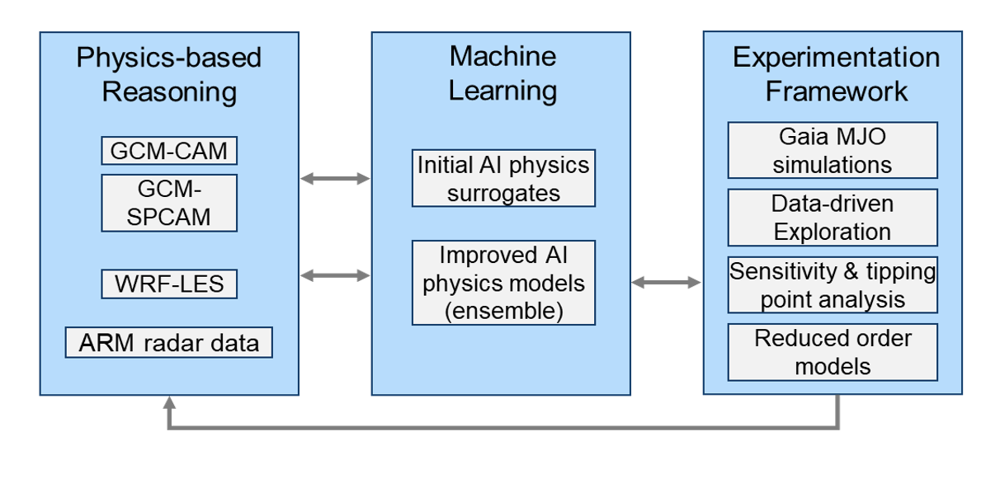

# Global AI Accelerator - GAIA <!-- omit in toc --> 

Welcome to GAIA Team Project Page, a DARPA AIE ACTM project.
- [Sections](#sections)
- [Overview](#overview)
- [Milestone Reports](#milestone-reports)

## Team <!-- omit in toc --> 
- [STR](www.str.us)
- [University of New South Wales, Sydney](https://www.ccrc.unsw.edu.au/ccrc-team/academic-research/steven-sherwood)

## Sections
- [Datasets](sections/datasets/README.md) - description of datasets used in surrogate training
- [Surrogate Details and Hyperparameter Sweeps](sections/baseline_hparams/README.md) - neural network architecture and hyperparameter comparison
- [Comparison of Surrogates Trained on Different Datasets](sections/surrogate_comparison/README.md) - compare surrugates to CAM4, SPCAM simulations and compare CAM4 and SPCAM4 trained surrogates to each other
- [Baseline Input Ablation](sections/baseline_input_ablation/README.md) - ablation of input variables and their effect of model performance
- [Surrogate with Memory Inputs](sections/memory/README.md) - improving surrogate performance by adding memory i.e. outputs from previous timestep
- [Integration of AI Surrogate into GCM](sections/gcm_integration/README.md) - deploying GAIA ML model in the GCM
- [MJO Analysis](sections/mjo_analysis/README.md) - analysis of MJO in the datasets

## Overview

**Concept & Approach**
- Develop new hybrid AI tools and methods to accelerate ultra-high-resolution Global Climate Models (GCMs) models, substituting AI local surrogates to improve cloud-resolving physics
- Test climate “tipping point” hypotheses, with focus on the Madden Julian Oscillation (MJO) 

**What’s hard?**
- GCMs are computationally expensive and lack the resolution needed to adequately model local convection and thus clouds
- This greatly increases GCM forecast errors and impedes propagation of large-scale wave phenomena such as the MJO 
- 
**What will GAIA accomplish?**
- Enable a GCM to accurately model local convection and predict self-organizing atmospheric wave phenomena 
- Exploit this GCM to explore possible future regimes and identify early warning signatures for MJO-related tipping points.
- 
**Progress**
- Developed and validated high-skill AI surrogates for multiple GCM local models, including CAM4, SPCAM with Morrison micro-physics, SPCAM with CLUBB cloud parameterization
- Currently studying impact of added memory and ablating inputs
- Next Steps: 
  - Determine input regimes where CAM/SPCAM underperform
  - Analyze GCM sensitivity using lower order dynamical model 
  - Apply results to selectively enhance local surrogate using ultra-high-resolution local eddy simulation for training. 
  - Integrate surrogate into GCM; use GCM to test MJO hypotheses

## Milestone Reports

- [Milestone Report 1](milestone_report_1.pdf)
- [Milestone Report 2](milestone_report_2.pdf)

[.](sdfhj32fsfva/results.md)