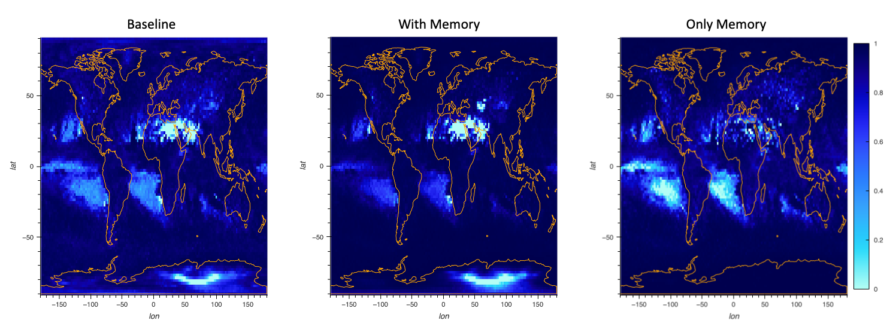
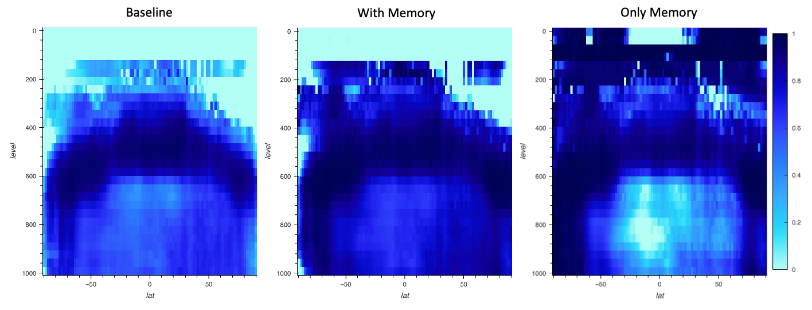
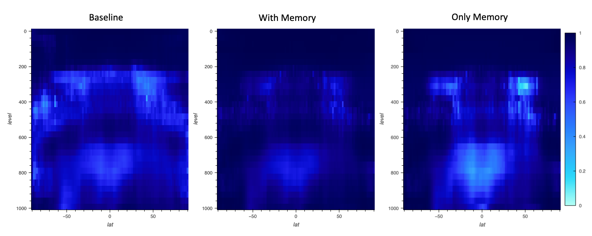

# Results
## SPCAM results

### Dataset

- dataset - 3 years, 16 time steps per day (0:00,0:20min, 3:00,3:200min, ... )
- train: 2 years, subsampled by 4, so 365x2x2x144x96 vertical columns (randomly sampled over time,lat,lon)
- test: 1 year, subsampled by 4, so 365x1x2x144x96 vertical columns (test sammpled 2 per day for every lat,lon grid cell)

### Inputs

`x_t`

| Name | Long Name | shape | unit |
| --- | --- | --- | --- |
| Q | Specific humidity | (16, 30, 96, 144) | kg/kg|
| T | Temperature | (16, 30, 96, 144) | K|
| U | Zonal wind | (16, 30, 96, 144) | m/s|
| V | Meridional wind | (16, 30, 96, 144) | m/s|
| OMEGA | Vertical velocity (pressure) | (16, 30, 96, 144) | Pa/s|
| PSL | Sea level pressure | (16, 96, 144) | Pa|
| SOLIN | Solar insolation | (16, 96, 144) | W/m2|
| SHFLX | Surface sensible heat flux | (16, 96, 144) | W/m2|
| LHFLX | Surface latent heat flux | (16, 96, 144) | W/m2|
| FSNS | Net solar flux at surface | (16, 96, 144) | W/m2|
| FLNS | Net longwave flux at surface | (16, 96, 144) | W/m2|
| FSNT | Net solar flux at top of model | (16, 96, 144) | W/m2|
| FLNT | Net longwave flux at top of model | (16, 96, 144) | W/m2|
| Z3 | Geopotential Height (above sea level) | (16, 30, 96, 144) | m|

### Outputs

`y_t`

| Name | Long Name | shape | unit |
| --- | --- | --- | --- |
| PRECT | Total (convective and large-scale) precipitation rate (liq + ice) | (16, 96, 144) | m/s|
| PRECC | Convective precipitation rate (liq + ice) | (16, 96, 144) | m/s|
| PTEQ | Q total physics tendency | (16, 30, 96, 144) | kg/kg/s|
| PTTEND | T total physics tendency | (16, 30, 96, 144) | K/s|

### Skill Plots

- Baseline model: 7 FCN layers  `f(x_t) -> y_t`
- Memory model: 7 FCN layers  `f(x_t,y_{t_1}) -> y_t`
- Only Memory model: `y_{t-1} -> y_t`

#### Total (convective and large-scale) precipitation rate

#### Q total physics tendency

#### T total physics tendency

#### Interactive Plots

[Baseline](spcam/plots_baseline.html), 
[With Memory](spcam/plots_memory.html), 
[Only Memory](spcam/plots_naive.html)

