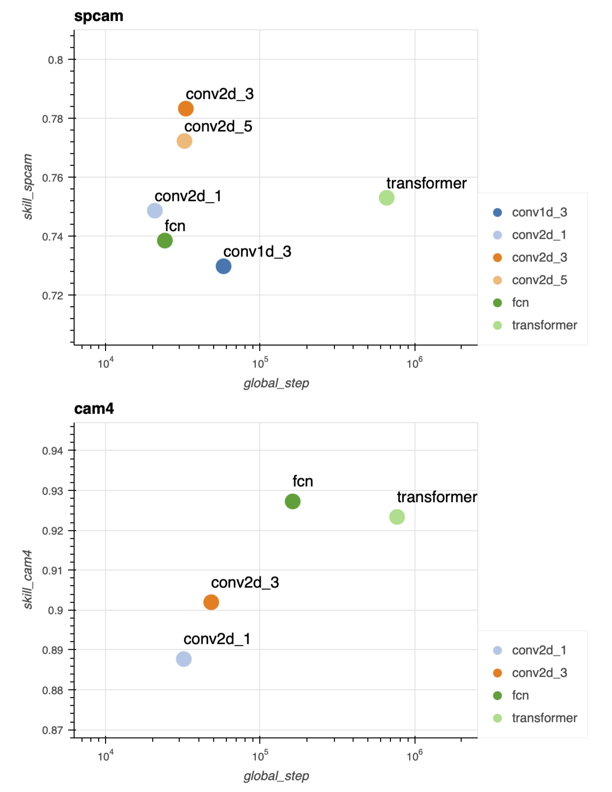

# Comparison of Different Surrogate Neural Network Architectures

We compare skill of trained surrogates with different architectures. The models are designed to have approx. same number of parameters: `1.5 millions`.

There are two variations:

| Architecture | Description |  
| -- | -- |  
| **Non-spatial** | *models treat each grid column independently* |  
 | fcn | fully connected network, 7 dense layers |  
| conv1d_k | 1 dimensional conv net with dialation, z / levels = sequence dimension, variables = channel dimension, k = kernel size |  
 | transformer |  transformer encoder model with z / level position encoding, z / levels = sequence dimension, variables = channel dimension |  
| **Spatial** | *models can use information from neighbouring grids in making predictions* |  
| *conv2d_k* | 2 dimensional seperable depthwise conv net, lat/lots = 2d spatial dimensions, variables stacked as channels, k = kernel size |  

](skill_vs_nn_arch.html)