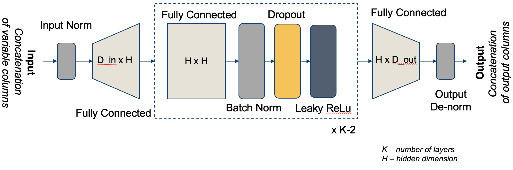
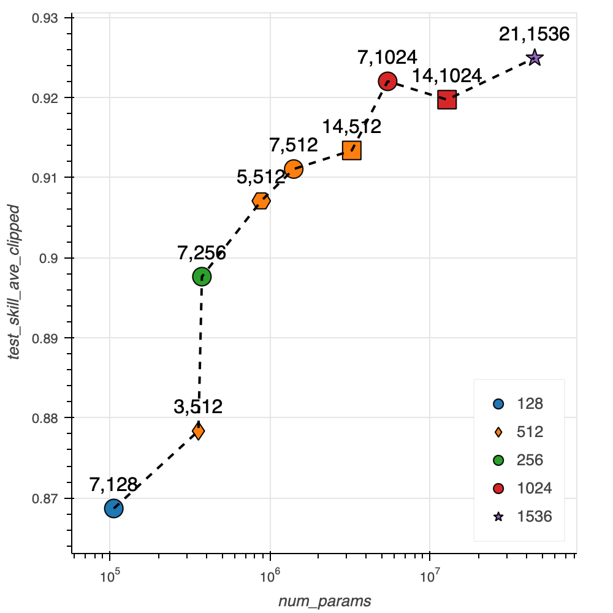

# Baseline Surrogate Model
## Surrogate Architecture

- 7 FCN (fully connected layers)
- Each layer has a hidden dimension of 512.
- Each layer is followed by batch normalization and dropout with rate of .1

 

## Hyperparameters

We evaluate several parameter values:
- num_layers: 3,5,7,14
- hidden_size: 128, 256, 512, 1024, 1536

 
<!-- ](baseline_hparams.png)] -->

