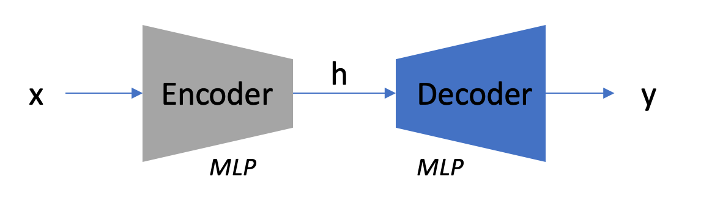
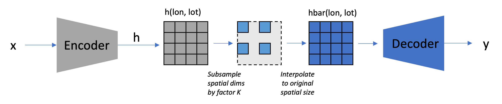
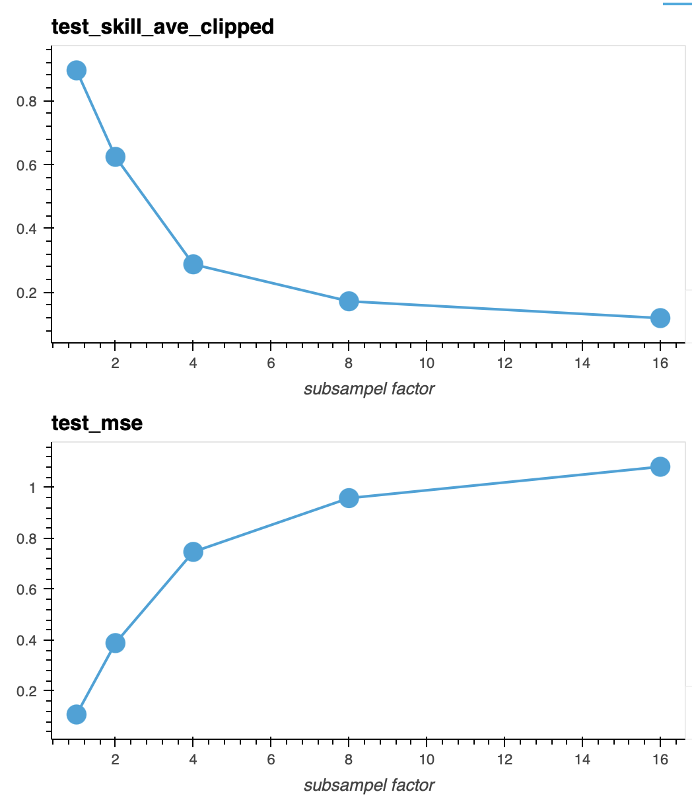

# Bottleneck Encoder Decoder
- We train an encoder and decoder network to understand the intrinsic dimension of the input data.  
- Encoder maps input `x->h` of dimension d and while decoder maps `h->y` to the output.  
- We compute performance for every output variable and overall.  

Encoder-decoder network we used is below:

We see that we can retain most of the performance for bottlenecck dimensions of 32.

## CAM4

## SPCAM

# Testing Spatial Subsampling

We further investigate if we can simplify the spatial dimensions of our model. Surrogate models operate on weather column inputs at different lat,lon locations in space. The local model itself is space agnostic; however to understand the global model, we test if we can reduce the spatial dimensionsality by subsampling and then interpolating in the bottleneck representation.

We observe a pretty significant degradation of performance if at a subsampling factor of 2.

