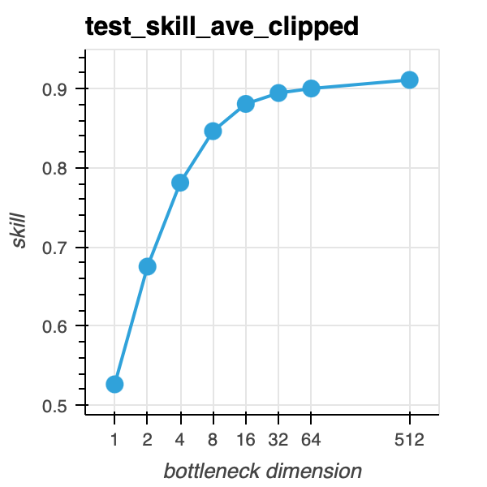
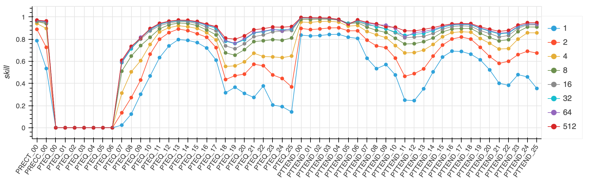
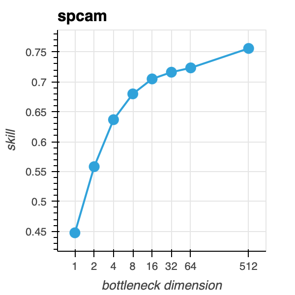
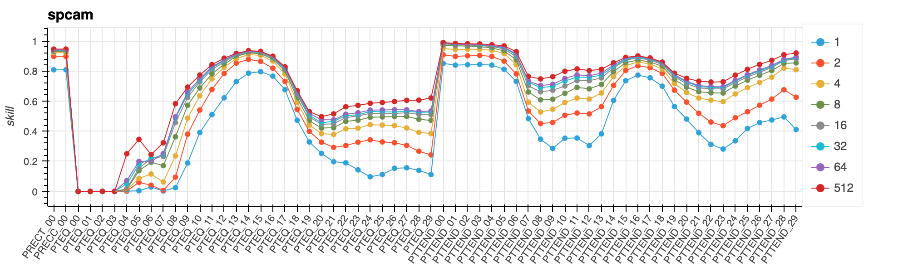

# Bottleneck Encoder Decoder
- We train an encoder and decoder network to understand the intrinsic dimension of the input data.  
- Encoder maps input `x->h` of dimension d and while decoder maps `h->y` to the output.  
- We compute performance for every output variable and overall.  

We see that we can retain most of the performance for bottlenecck dimensions of 32

## CAM4

## SPCAM
