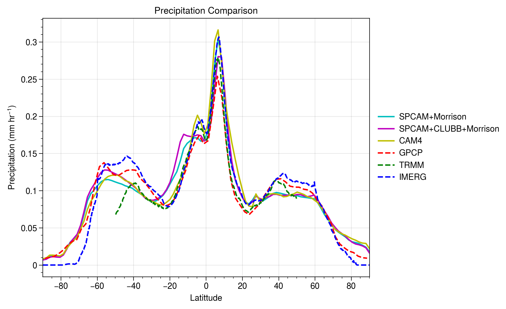

# Datasets

## GCM
- [Community Atmospheric Model (CAM4)](https://www.cesm.ucar.edu/models/ccsm4.0/cam/)
- 30 minute time-step
- 2.5-degree grid (144x96)
- 30 levels
- Four year run (1979 SST; Time Varying) which will be extended to ten years.
- Outputs every 3 hours + additional model time-step (memory)

## CRM
- [SPCAM (super parameterized CAM)](https://ncar.github.io/CAM/doc/build/html/users_guide/atmospheric-configurations.html#super-parameterized-cam-spcam)
- 20 minute time-step
- 16 SAM (The System for Atmospheric Modeling) Columns
- 26 levels
- Year 2000 SST (Climatology)
- Three year simulations:
  -  Morrison Microphysics + Conventional parameterization for moist convection and large-scale condensation.
  - Morrison Microphysics + Higher-order turbulence closure scheme, Cloud Layers Unified By Binormals (CLUBB)
- Outputs every 3 hours + additional model time-step (memory)

## LES
- [WRF (Weather Research and Forecasting Model)](https://www2.mmm.ucar.edu/wrf/users/model_overview.html)
- 50 km x 50 km domains; periodic boundary conditions
- 100 levels
- 100 weather cases
- 1 week spin up at 2 km + 5 day simulation at 200m resolution (LES)
- 3 hourly Boundary Conditions by SPCAM runs + nudging of state variables
- History outputs at 10 minutes (horizontally averaged and mapped to same vertical grid as CAM4)

## Output Variables
  -	Total (convective and large-scale) precipitation rate (liq + ice), PRECT
  -	Convective precipitation rate (liq + ice), PRECC
  -	Q total physics tendency, PTEQ
  -	T total physics tendency, PTTEND
  -	Specific humidity, Q
  -	Temperature, T
  -	Zonal wind, U
  -	Meridional wind, V
  -	Vertical velocity, OMEGA
  -	Sea Level Pressure, SLP
  -	Solar Insolation, SOLIN
  -	Sensible Heat Flux, SHFLX
  -	Surface Latent Heat Flux, LHFLX
  -	Net Solar Flux at Surface, FSNS
  -	Net Longwave Flux at Surface, FLNS
  -	Net Solar Flux at the Top of Model, FSNT
  -	Net Longwave Flux at the Top of Model, FLNT

## Evaluations
All the simulations have been evaluated zonally for Precipitation and Outgoing Longwave Radiation (OLR) using satellite observations.

*Zonal distribution of precipitation using model runs (solid lines) and satellite observations (dashed lines).*

*Zonal distribution of Outgoing Longwave Radiation (OLR) using model runs (solid lines) and satellite observations (dashed lines).*
