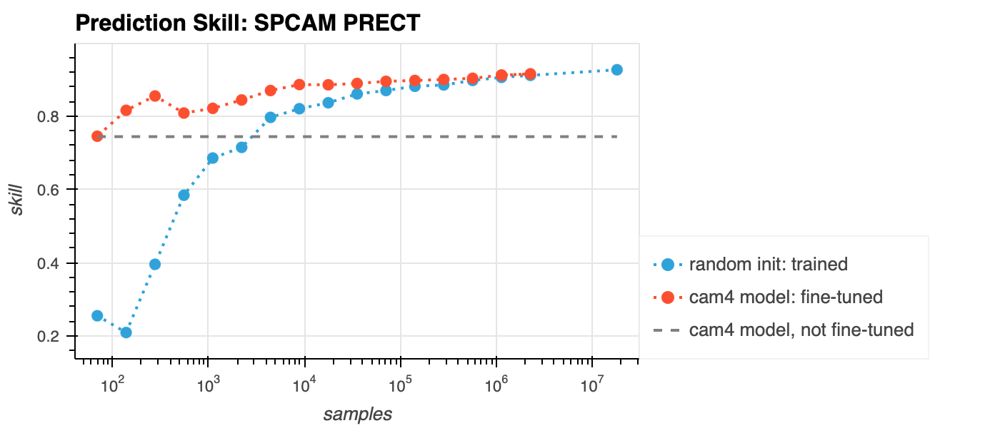

# Finetuning Experiments

Our strategy is to iteravly refine neural networks surrogates by training on them on progessively higher fidelity physics simulation data.

To test our our fine-tuning strategy, we fine-tune a CAM4 trained NN surrogate on an increasing amount of SPCAM data. We compare fine-tuned model to a regular model trained from SCRATCH on the SPCAM data using the same amount data.

The following plot shows the benefit of fine-tuning vs training from scratch.

Training paramaters:
- Total number of samples, N = 18e6, (in SPCAM training data)
- Subsample factor, S = 2 ^ [3, 4, …. , 17]
- For all, max_epochs: 200 / log(S)
- For all, batch_size = min( 24 x 96 x 144,  N / S)
- Fine-tune: learning rate 5e-5, no learning rate schedule
- Train from scratch/random init: learning rage 1e-3, warm up schedule (ramp from 0 to lr during first 10% of epochs and then ramp down from lr to 0 during last 90%)
- Best model over epochs taken w.r.t. to validation set