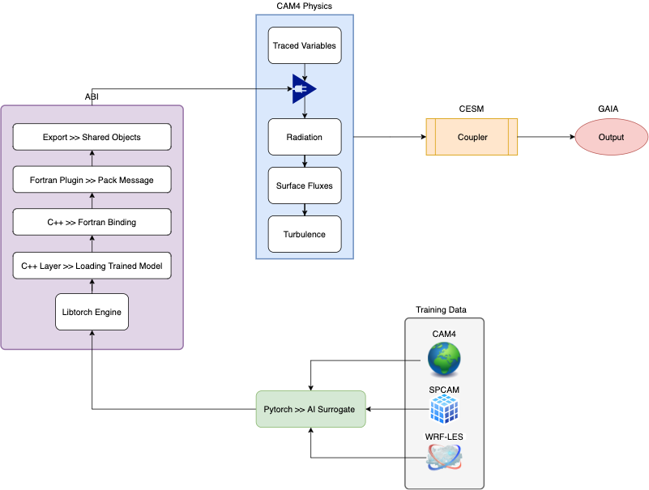

# GCM Integration

Refer to our [deployment repo](https://github.com/stresearch/gaia-deploy).

## Strategy
[](GCM_integration.png)

## Application Binary Interface (ABI) Development
- Start with total T,Q physics tendencies and track them back
- Check all the tendency updates from all processes
- Verify all inputs and outputs that are needed with all the tendency updates
- Find out where we want to intercept the variables
- Export Pytorch Model with Torchscript
- Bypass Python by using C++
- Call C++ within Fortran

## Exporting Pytorch Model

We export pytorch surrogate model to a torchscript format. This enables us to load a checkpoint with C++.

```C++

#include <torch/script.h> // One-stop header.

#include <iostream>
#include <memory>

int main(int argc, const char* argv[]) {
  if (argc != 2) {
    std::cerr << "usage: example-app <path-to-exported-script-module>\n";
    return -1;
  }


  torch::jit::script::Module module;
  try {
    // Deserialize the ScriptModule from a file using torch::jit::load().
    module = torch::jit::load(argv[1]);
  }
  catch (const c10::Error& e) {
    std::cerr << "error loading the model\n";
    return -1;
  }

  std::cout << "ok\n";

    // Create a vector of inputs.
  std::vector<torch::jit::IValue> inputs;
  inputs.push_back(torch::ones({20, 164}));

  // Execute the model and turn its output into a tensor.
  at::Tensor output = module.forward(inputs).toTensor();
  std::cout << output.slice(/*dim=*/1, /*start=*/0, /*end=*/5) << '\n';

}

```
## Plans
1. Naive Model
    - Input and output spaces matched with the surrogate model 
    - Model should output tendencies from an arbitrary time-step in CAM4 data
    - Written in Pytorch and output as Torchscript
2. Create a new package for CAM4 Physics 
    - Ensure that the input and output of this package matches the surrogate model input/output
    - Ensure that the input and output of this package covers all of CAM4 physics
    - Create a shared object to be loaded by the new package (shared object using C++)
3. Run CAM4 hybrid
    - Run CAM4 with the new package but with no updates to tendencies (just to see that it does not crash)
    - Run CAM4 mixing old and new added model
    - Turn CAM4 parametrisations gradually testing that the model can work only with the new hybrid package
    - Replace Naive model with AI surrogate once ready
4. LES Runs
    - Use boundary conditions from CAM4 (CAM4 VTable) to feed to WRF
    - Write a converter taking WRF outputs and converting to CESM/CAM4 formats 
    - Re-train the AI surrogate model and export using Torchscript


