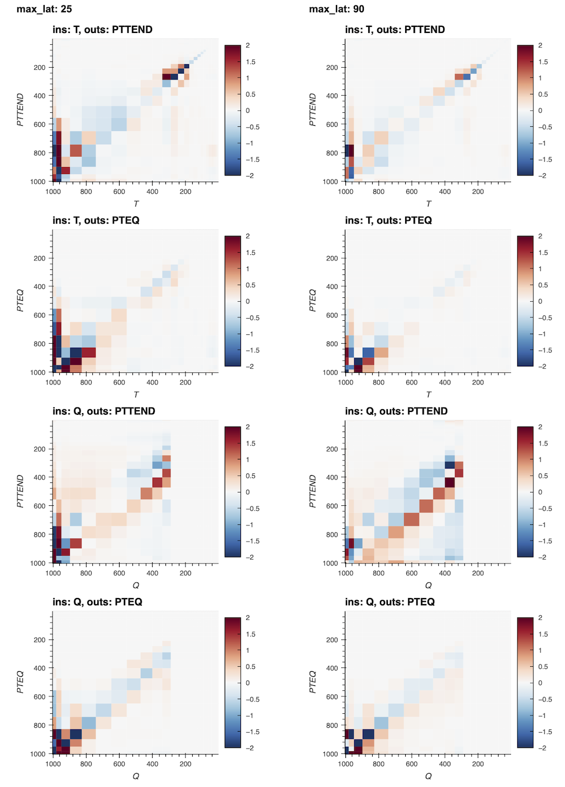

# Linearization of NN Surrogate Model

We compute linearization of the NN surrigate f(x) = y, to understand sensitivity to different inputs.

Linearization of $f(x) = Ax + b$, can be computed by taking the gradiant  $grad~f(x)$ around $x$. Since f(x) is vector valued we compute a jacobian instead: $A = J_x(f(x))$. 

## CAM4

###  Jacobian of Temperature and Humidity Tendencies

- We can compare empirical Jacobian of surrogate NN with reference CRM computations.
- While the general structure is present in the surrogate, it still somewhat noisy. 
- We plan to add Jacobian structure as an additional regularization during optimization to (hopefully) encourage stability during intergration into the climate model.
> To compute the Jacobian, we sample 10000 data inputs from desired region, compute a jacobian around each sample using  NN autodifferentiation and then average. We found that this computation is more stable then computing Jacobian around a mean input.

[*Click on figure for interactive visualization*](jacobian_proper_scale.html)

Jacobian CAM4 FCN NN  |  Reference from CRM (Fig 8. Kuang 2012)
:-------------------------:  |      :-------------------------:
 | 

<!-- [*By different lats*](jacobian_norm_cam4_by_lats.html) -->

<!-- ### l2 Normalized Jacobian of All Inputs

To visualize how much each input perturbs every output, we l2 normalize each row of J. The following figure breaks up J by different output and input groups. This is computed around the mean input.

[*Click on figure for interactive visualization*](jacobian.html)
 -->
