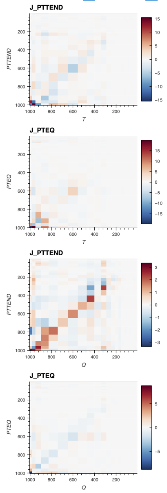
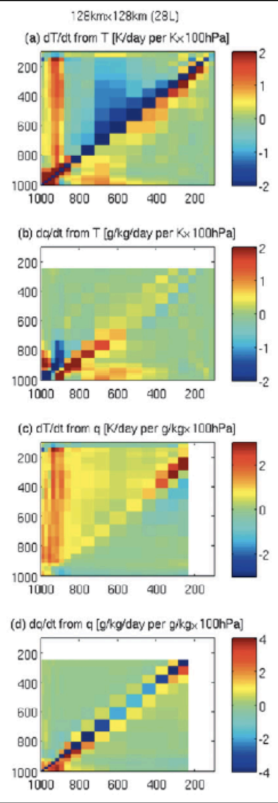
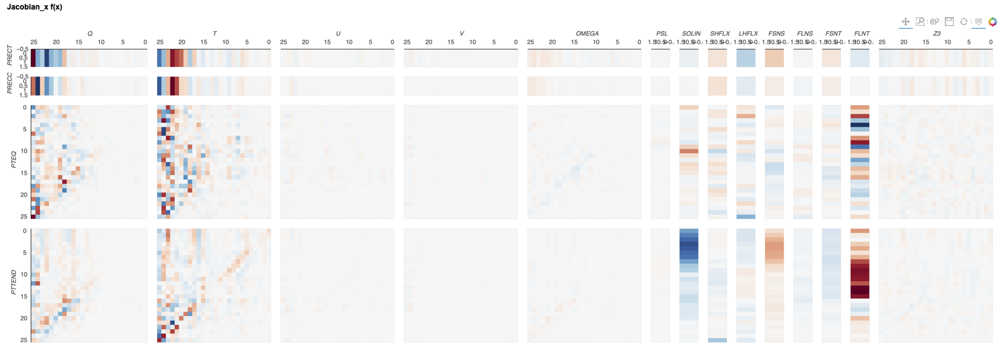

# Linearization of NN Surrogate Model

We compute linearization of the NN surrigate f(x) = y, to understand sensitivity to different inputs.

Linearization of f(x`) = Ax` + b, can be computed by computing the gradiant grad f(x) around x`. Since f(x) is vector valued we compute a jacobian: A = J_x(f(x)). 

## CAM4

### Normalized Jacobian of Temperature and Humidity Tendencies
[*Click on figure for interactive visualization*](jacobian_norm_cam4.html)

Normalized Jacobian CAM4 NN  |  Reference from CRM (Fig 8. Kuang 2021)
:-------------------------:  |      :-------------------------:
 | 

[*By different lats*](jacobian_norm_cam4_by_lats.html)

### l2 Normalized Jacobian of All Inputs

To visualize how much each input perturbs every output, we l2 normalize each row of J. The following figure breaks up J by different output and input groups. This is computed around the mean input.

[*Click on figure for interactive visualization*](jacobian.html)

