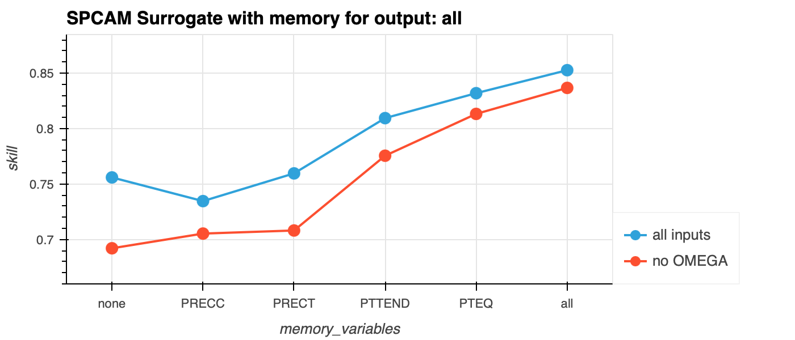
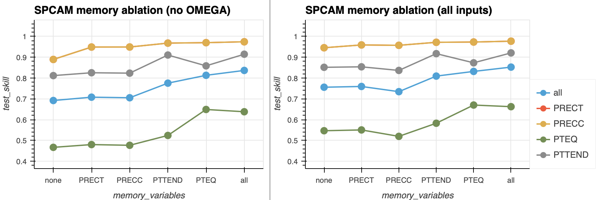

# Adding Memory to Surrogate Model

We evalate improvement in skill when adding additional memory input to the surrogate model
- We test adding output variable from the previous time steps as an additional input
- We measure improvement in skill for multiple cases (on the SPCAM trained model)
  - Adding one memory variable at a time
  - Adding all variables
  - Same as above but removing OMEGA as an input
- Note that PRECT, PRECC are scalars while PTEQ and PTTEND are vector values at 30 levels
- As expected, adding memory of output variable X, improves skill in predicting that variable

We can further break down skill by output variable

## Variable names for reference

### Inputs

| Name | Long Name | shape | unit |
| --- | --- | --- | --- |
| Q | Specific humidity | (T, L, 96, 144) | kg/kg|
| T | Temperature | (T, L, 96, 144) | K|
| U | Zonal wind | (T, L, 96, 144) | m/s|
| V | Meridional wind | (T, L, 96, 144) | m/s|
| OMEGA | Vertical velocity (pressure) | (T, L, 96, 144) | Pa/s|
| PSL | Sea level pressure | (T, 96, 144) | Pa|
| SOLIN | Solar insolation | (T, 96, 144) | W/m2|
| SHFLX | Surface sensible heat flux | (T, 96, 144) | W/m2|
| LHFLX | Surface latent heat flux | (T, 96, 144) | W/m2|
| FSNS | Net solar flux at surface | (T, 96, 144) | W/m2|
| FLNS | Net longwave flux at surface | (T, 96, 144) | W/m2|
| FSNT | Net solar flux at top of model | (T, 96, 144) | W/m2|
| FLNT | Net longwave flux at top of model | (T, 96, 144) | W/m2|
| Z3 | Geopotential Height (above sea level) | (T, L, 96, 144) | m|

### Outputs

| Name | Long Name | shape | unit |
| --- | --- | --- | --- |
| PRECT | Total (convective and large-scale) precipitation rate (liq + ice) | (T, 96, 144) | m/s|
| PRECC | Convective precipitation rate (liq + ice) | (T, 96, 144) | m/s|
| PTEQ | Q total physics tendency | (T, L, 96, 144) | kg/kg/s|
| PTTEND | T total physics tendency | (T, L, 96, 144) | K/s|