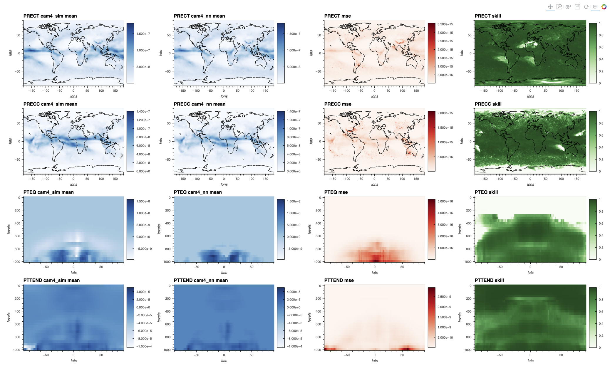
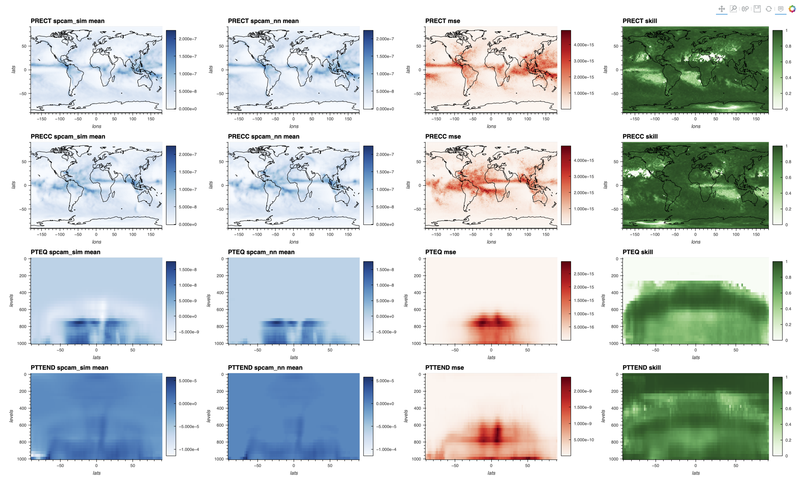
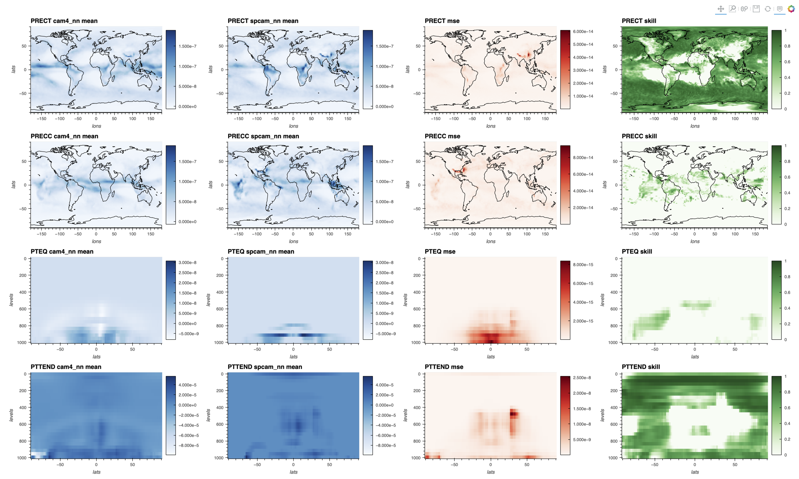
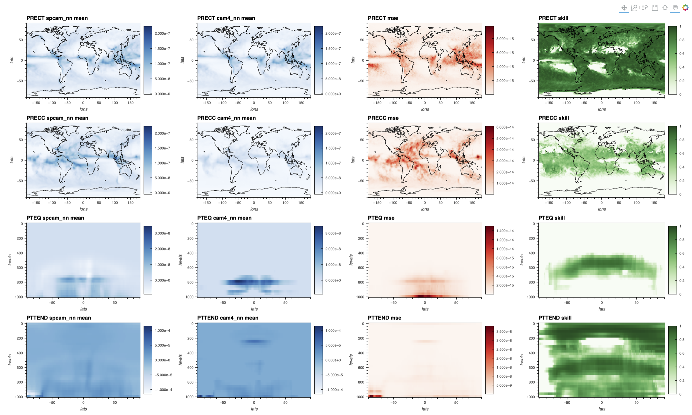

# Comparison of Surrugate Models

- [Comparison of Surrugate Models](#comparison-of-surrugate-models)
  - [CAM4 Simulation vs CAM4-trained Neural Network](#cam4-simulation-vs-cam4-trained-neural-network)
  - [SPCAM Simulation vs SPCAM-trained Neural Network](#spcam-simulation-vs-spcam-trained-neural-network)
  - [CAM4-trained Neural Network vs SPCAM-trained Neural Network](#cam4-trained-neural-network-vs-spcam-trained-neural-network)
  - [SPCAM-trained Neural Network vs CAM4-trained Neural Network](#spcam-trained-neural-network-vs-cam4-trained-neural-network)
  - [Animations of Model Performance and Comparison Over Time](#animations-of-model-performance-and-comparison-over-time)

## CAM4 Simulation vs CAM4-trained Neural Network

## SPCAM Simulation vs SPCAM-trained Neural Network

## CAM4-trained Neural Network vs SPCAM-trained Neural Network

Both models are evaluated on the CAM4 input datas

## SPCAM-trained Neural Network vs CAM4-trained Neural Network

Both models are evaluated on the SPCAM input datas

## Animations of Model Performance and Comparison Over Time

Videos showing:
- output over time for two models
- absolute error between model outputs
- skill-like metric where variance is computed over the time component

Table columns:
- model1 - name of first model
- model2 - name of second model
- output - output variable
- evalated on - dataset model evaluated on
  
model naming convension: `{dataset}_{type}` where  
-  `type` in `sim[ulation],nn[neural network]`
-  `dataset` in `cam4,spcam` that the model is trained on `type==nn` or name of simulator

|model1|model2|output|evaluated on|video|
|---|---|---|---|---|
|cam4_nn|spcam_nn|PRECC|cam4|[cam4_nn-spcam_nn-PRECC.mp4](https://855da60d-505b-4eee-942c-e19fb87dcc5f.s3.amazonaws.com/gaia/videos/cam4_nn-spcam_nn-PRECC.mp4)|
|cam4_nn|spcam_nn|PRECT|cam4|[cam4_nn-spcam_nn-PRECT.mp4](https://855da60d-505b-4eee-942c-e19fb87dcc5f.s3.amazonaws.com/gaia/videos/cam4_nn-spcam_nn-PRECT.mp4)|
|cam4_nn|spcam_nn|PTEQ_24|cam4|[cam4_nn-spcam_nn-PTEQ_24.mp4](https://855da60d-505b-4eee-942c-e19fb87dcc5f.s3.amazonaws.com/gaia/videos/cam4_nn-spcam_nn-PTEQ_24.mp4)|
|cam4_nn|spcam_nn|PTEQ_25|cam4|[cam4_nn-spcam_nn-PTEQ_25.mp4](https://855da60d-505b-4eee-942c-e19fb87dcc5f.s3.amazonaws.com/gaia/videos/cam4_nn-spcam_nn-PTEQ_25.mp4)|
|cam4_nn|spcam_nn|PTTEND_24|cam4|[cam4_nn-spcam_nn-PTTEND_24.mp4](https://855da60d-505b-4eee-942c-e19fb87dcc5f.s3.amazonaws.com/gaia/videos/cam4_nn-spcam_nn-PTTEND_24.mp4)|
|cam4_nn|spcam_nn|PTTEND_25|cam4|[cam4_nn-spcam_nn-PTTEND_25.mp4](https://855da60d-505b-4eee-942c-e19fb87dcc5f.s3.amazonaws.com/gaia/videos/cam4_nn-spcam_nn-PTTEND_25.mp4)|
|cam4_sim|cam4_nn|PRECC|cam4|[cam4_sim-cam4_nn-PRECC.mp4](https://855da60d-505b-4eee-942c-e19fb87dcc5f.s3.amazonaws.com/gaia/videos/cam4_sim-cam4_nn-PRECC.mp4)|
|cam4_sim|cam4_nn|PRECT|cam4|[cam4_sim-cam4_nn-PRECT.mp4](https://855da60d-505b-4eee-942c-e19fb87dcc5f.s3.amazonaws.com/gaia/videos/cam4_sim-cam4_nn-PRECT.mp4)|
|cam4_sim|cam4_nn|PTEQ_24|cam4|[cam4_sim-cam4_nn-PTEQ_24.mp4](https://855da60d-505b-4eee-942c-e19fb87dcc5f.s3.amazonaws.com/gaia/videos/cam4_sim-cam4_nn-PTEQ_24.mp4)|
|cam4_sim|cam4_nn|PTEQ_25|cam4|[cam4_sim-cam4_nn-PTEQ_25.mp4](https://855da60d-505b-4eee-942c-e19fb87dcc5f.s3.amazonaws.com/gaia/videos/cam4_sim-cam4_nn-PTEQ_25.mp4)|
|cam4_sim|cam4_nn|PTTEND_24|cam4|[cam4_sim-cam4_nn-PTTEND_24.mp4](https://855da60d-505b-4eee-942c-e19fb87dcc5f.s3.amazonaws.com/gaia/videos/cam4_sim-cam4_nn-PTTEND_24.mp4)|
|cam4_sim|cam4_nn|PTTEND_25|cam4|[cam4_sim-cam4_nn-PTTEND_25.mp4](https://855da60d-505b-4eee-942c-e19fb87dcc5f.s3.amazonaws.com/gaia/videos/cam4_sim-cam4_nn-PTTEND_25.mp4)|
|spcam_nn|cam4_nn|PRECC|spcam|[spcam_nn-cam4_nn-PRECC.mp4](https://855da60d-505b-4eee-942c-e19fb87dcc5f.s3.amazonaws.com/gaia/videos/spcam_nn-cam4_nn-PRECC.mp4)|
|spcam_nn|cam4_nn|PRECT|spcam|[spcam_nn-cam4_nn-PRECT.mp4](https://855da60d-505b-4eee-942c-e19fb87dcc5f.s3.amazonaws.com/gaia/videos/spcam_nn-cam4_nn-PRECT.mp4)|
|spcam_nn|cam4_nn|PTEQ_28|spcam|[spcam_nn-cam4_nn-PTEQ_28.mp4](https://855da60d-505b-4eee-942c-e19fb87dcc5f.s3.amazonaws.com/gaia/videos/spcam_nn-cam4_nn-PTEQ_28.mp4)|
|spcam_nn|cam4_nn|PTEQ_29|spcam|[spcam_nn-cam4_nn-PTEQ_29.mp4](https://855da60d-505b-4eee-942c-e19fb87dcc5f.s3.amazonaws.com/gaia/videos/spcam_nn-cam4_nn-PTEQ_29.mp4)|
|spcam_nn|cam4_nn|PTTEND_28|spcam|[spcam_nn-cam4_nn-PTTEND_28.mp4](https://855da60d-505b-4eee-942c-e19fb87dcc5f.s3.amazonaws.com/gaia/videos/spcam_nn-cam4_nn-PTTEND_28.mp4)|
|spcam_nn|cam4_nn|PTTEND_29|spcam|[spcam_nn-cam4_nn-PTTEND_29.mp4](https://855da60d-505b-4eee-942c-e19fb87dcc5f.s3.amazonaws.com/gaia/videos/spcam_nn-cam4_nn-PTTEND_29.mp4)|
|spcam_sim|spcam_nn|PRECC|spcam|[spcam_sim-spcam_nn-PRECC.mp4](https://855da60d-505b-4eee-942c-e19fb87dcc5f.s3.amazonaws.com/gaia/videos/spcam_sim-spcam_nn-PRECC.mp4)|
|spcam_sim|spcam_nn|PRECT|spcam|[spcam_sim-spcam_nn-PRECT.mp4](https://855da60d-505b-4eee-942c-e19fb87dcc5f.s3.amazonaws.com/gaia/videos/spcam_sim-spcam_nn-PRECT.mp4)|
|spcam_sim|spcam_nn|PTEQ_28|spcam|[spcam_sim-spcam_nn-PTEQ_28.mp4](https://855da60d-505b-4eee-942c-e19fb87dcc5f.s3.amazonaws.com/gaia/videos/spcam_sim-spcam_nn-PTEQ_28.mp4)|
|spcam_sim|spcam_nn|PTEQ_29|spcam|[spcam_sim-spcam_nn-PTEQ_29.mp4](https://855da60d-505b-4eee-942c-e19fb87dcc5f.s3.amazonaws.com/gaia/videos/spcam_sim-spcam_nn-PTEQ_29.mp4)|
|spcam_sim|spcam_nn|PTTEND_28|spcam|[spcam_sim-spcam_nn-PTTEND_28.mp4](https://855da60d-505b-4eee-942c-e19fb87dcc5f.s3.amazonaws.com/gaia/videos/spcam_sim-spcam_nn-PTTEND_28.mp4)|
|spcam_sim|spcam_nn|PTTEND_29|spcam|[spcam_sim-spcam_nn-PTTEND_29.mp4](https://855da60d-505b-4eee-942c-e19fb87dcc5f.s3.amazonaws.com/gaia/videos/spcam_sim-spcam_nn-PTTEND_29.mp4)|
